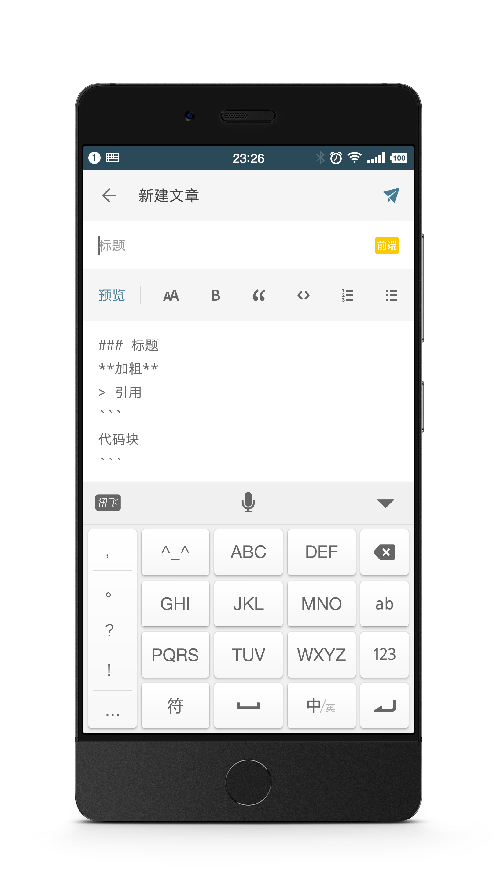
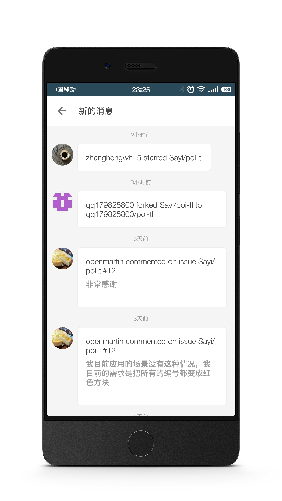

# Blogger

 Android app, based on github issues.

# GitHub博客APP
代码人的博客，基于GitHub Issues创建，包含以下内容：
1. 创建博客文章以及分类
2. 查看其它人的主页，文章
3. 支持文章评论，支持Markdown编辑器
4. 注重代码的分享，可分享到微信、微博、朋友圈
5. 查看GitHub关注、评论、创建等消息

# 源码&下载

> 源码整理中...在下一版本1.0.0-release开源。

当前版本：0.9.9-alpha

[APK下载页面](http://deepoove.com/github-blog/)

同时支持应用商店(搜索：GitHub或者GitHub博客)：
1. Smartisan应用商店
2. 百度手机助手
3. 小米应用商店

# 截图

